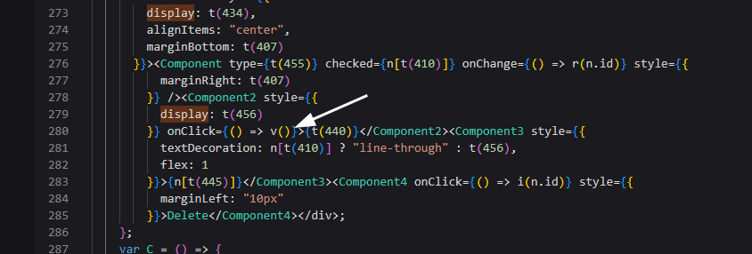
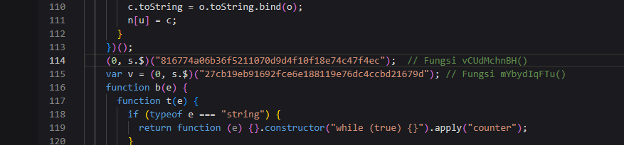
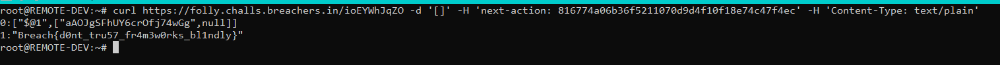

# Framework Follies

## Description
```
Modern full-stack frameworks are safe, right?
```

## Explanation
Given a .zip file containing a nextjs application obfuscated with the **nextjs-obfuscator**

In the src/app/ folder there are many folders, but there is one folder of a different size from the others, namely a folder named `ioEYWhJqZO`. When checking the actions.ts file, there is a function that uses **NextJS Server Actions** to display flags.

### action.ts
```
"use server";

export async function mYbydIqFTu() {

}

export async function vCUdMchnBH() {
  return process.env.f14g;
}
```

To access the vCUdMchnBH() function, you must use the hash generated by nextjs at compile time. You can do this by looking at the generated js file located at: `https://folly.challs.breachers.in/_next/static/chunks/app/ioEYWhJqZO/page-858b44029101e68c.js`

### page.tsx
```
"use client";

import React, { useState, useEffect } from "react";
import { mYbydIqFTu } from "./actions"

[...SNIP...]
      <button style={{ display: "none" }} onClick={() => mYbydIqFTu()}>Test</button>
[...SNIP...]
```

seen from the page.tsx file before generating the function called only `mYbydIqFTu()` but when compiled all functions will be exported to hash.

here I use `webcrack.netlify.app` to parse the compiled js file, on line 280 there is a v() function that is used to call server actions


In webcrack right-click and then press "Go to Definition" then the hash will appear for the `mYbydIqFTu()` and `vCUdMchnBH()` functions.



Next, just call the function using the hash obtained.


Flag: **Breach{d0nt_tru57_fr4m3w0rks_bl1ndly}**