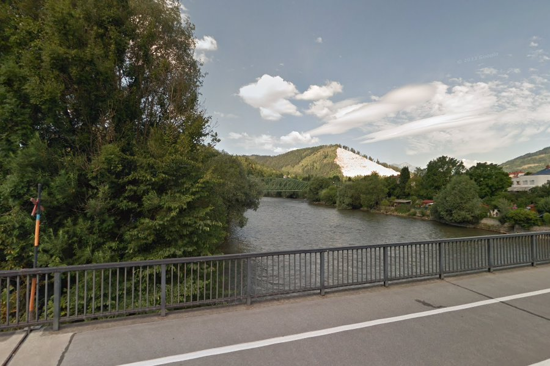
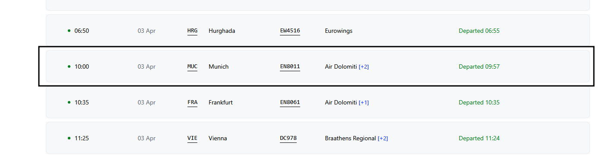

# On the Clock
## Description
```
A traveler named Alex paused to snap this photo during sunrise while en route to the airport. Known for always being on time, he was heading to catch a flight scheduled to depart on 3rd April. Oddly, he always speaks fondly of October. Can you trace his journey from this one clue?

Flag Format: Breach{originAirportCodeDestinationAirportCodeOperatorFlightNumber} (All uppercase airport codes, no spaces. Example: Breach{LAXJFKAA100})
```

## Explanation


Given the image above, a Google Images search will return a website that contains a similar image, namely "https://www.ausgeflogen.at/murradweg-etappen/". When searching with Google Maps it was found that its location is at the coordinates `47.3655417, 15.0949284` which is in the city of Leoben, Austria. When searching, the closest airport to this location is in the city of Graz, Austria. 

From the description above, the photo was taken at sunrise, which means the photo was taken in the morning, and he always talks about the month of October, which could refer to the Oktoberfest event in Munich.

After searching for all the data following the data obtained :

Origin Airport: Graz, Austria (GRZ)
Destination Airport: Munich, Germany (MUN)
Depart Date: 3 April
Depart Time: Morning

Searched for flight dates on the website `https://www.avionio.com/en/airport/grz/departures` and found dates that match the details above.


Flag: **Breach{GRZMUCEN8011}**