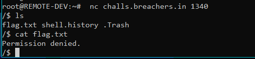
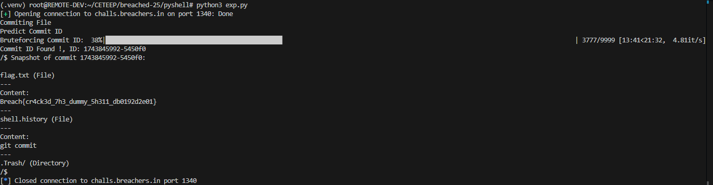

# Pyshell
## Description
```
I have made a shell which runs completely in python. It is soo secure that the files created disappear the moment I exit it. Try to read the VERY SECURE flag in the shell.
```

## Explanation
This challenge requires reading the flag.txt file in an isolated shell, but attempting to read it will result in a 'Permission denied.' response.


If checked, when reading a file named 'flag.txt' the script will block it, to read the file 'flag.txt' must use another way so that it is not blocked.

### shell.py
```python
def _cat(self, args):
    if len(args) != 1:
        print("Usage: cat <filename>")
        return
    filename = args[0]
    current_dir = self._get_current_dir()
    if current_dir is None:
        return
    entry = current_dir.entries.get(filename)
    if isinstance(entry, Symlink):
        entry = self._resolve_path(entry.target.strip("/").split("/"))
    if isinstance(entry, File):
        if entry.filename != "flag.txt": 
            print(entry.content)
        else:
            print("Permission denied.")
    else:
        print("File not found.")
```

To read the 'flag.txt' file, we can use the git command, first commit the file with 'git commit', then bruteforce the commit_id and use the command 'git snapshot [commit_id]'.

```python
def _git_commit(self, args):
    if args:
        print("Usage: git commit")
        return

    import time, random, hashlib

    commit_time = int(time.time())
    rand_val = random.randint(1, 10000)
    hash_val = hashlib.sha256(str(rand_val).encode()).hexdigest()[:6]
    commit_id = f"{commit_time}-{hash_val}"

    def snapshot(directory):
        data = {}
        for name, entry in directory.entries.items():
            if isinstance(entry, File):
                data[name] = (entry.content, "file")
            elif isinstance(entry, Directory):
                data[name] = snapshot(entry)
            elif isinstance(entry, Symlink):
                data[name] = (
                    entry.target,
                    "symlink",
                )
        return data

    commit_snapshot = snapshot(self.fs["/"])
    self.commit_history[commit_id] = commit_snapshot
    print(f"Committed.")
```

from the code above, the commit_id is generated by combining the current Unix timestamp (commit_time) with a 6 character hexadecimal substring of the SHA-256 hash of a random integer (rand_val between 1 and 10000). Specifically:

1. Timestamp: commit_time = int(time.time())
2. Random Value Hash:
    - Generate a random integer: `rand_val = random.randint(1, 10000)`
    - Compute its SHA-256 hash: `hashlib.sha256(str(rand_val).encode()).hexdigest()`
    - Take the first 6 characters of the hash: `[:6]` (e.g., "a1b2c3").

3. Final Commit ID:
    - Combine the timestamp and truncated hash into a string:
    `commit_id = f"{commit_time}-{hash_val}"` (e.g., "1625097635-a1b2c3").


Flag: **Breach{cr4ck3d_7h3_dummy_5h311_db0192d2e01}**